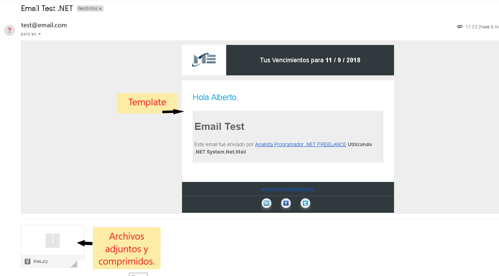

# Servicio de envio de Emails

El objetivo es crear un servicio de envio de emails que soporte archivos comprimidos, adjuntos y templates.

## Información

### Envio de emails con la librería de .NET

*System.Net.Mail:* es la libreria de .NET para el envio de emails.

El servicio soporta archivos comprimidos, adjuntos, exchange y templates.

***Doc oficial:*** https://msdn.microsoft.com/es-es/library/system.net.mail(v=vs.110).aspx

### Envio de emails con la librería de SendGrid

*SendGrid.Helpers.Mail:* es la libreria de SendGrid para el envio de emails.

El servicio soporta archivos comprimidos, adjuntos y templates.

***Doc oficial:*** https://github.com/sendgrid/sendgrid-csharp

### Resultado

## Testeado

- Visual Studio 2017

- .Net Core 2.x

- C# 7.x